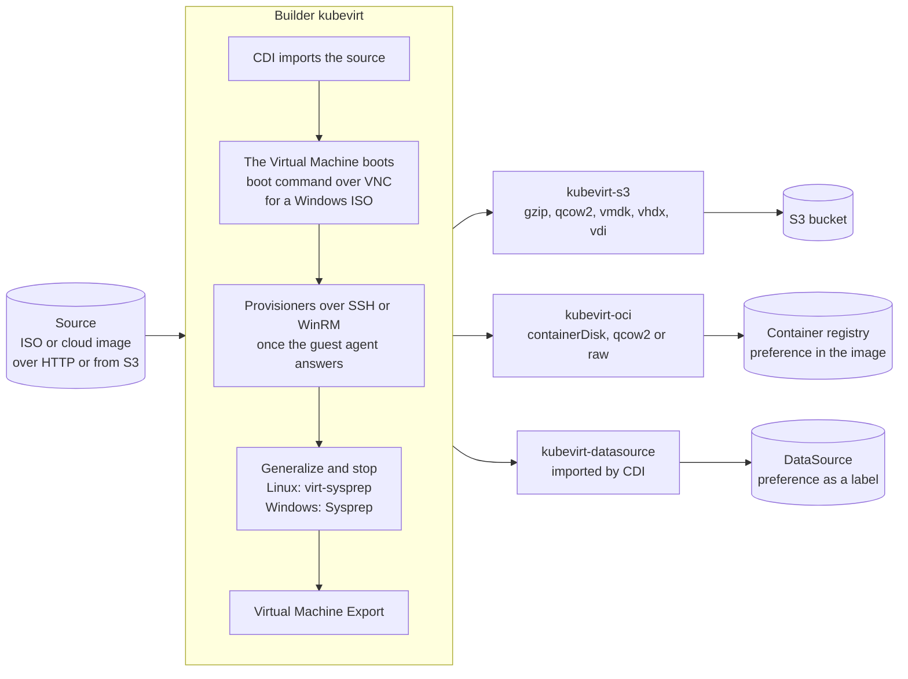

# KubeVirt Packer Plugin

Build virtual machine images on Kubernetes with [KubeVirt](https://kubevirt.io), then export them to S3, to a container registry, or keep them in the cluster.

## How it works



1. The builder creates a Virtual Machine from an ISO or a cloud image and waits for the guest to be ready.
2. Packer provisioners run in the guest over SSH or WinRM (shell, Ansible and so on).
3. The image is generalized and the Virtual Machine is stopped. Linux: the builder stops it, then runs `virt-sysprep` on the disk, unless `vm_skip_virt_sysprep` is set. Windows: Sysprep runs as your shutdown command and shuts it down.
4. The disk is exposed through a Virtual Machine Export.
5. Post-processors export the disk. Several can run on the same build.

Everything runs in the cluster, as Virtual Machines and jobs. Nothing else than Packer is needed on your machine.

## Components

| Component | Type | What it does |
|---|---|---|
| [kubevirt](docs/builders/kubevirt.mdx) | builder | Creates and provisions the Virtual Machine |
| [kubevirt-s3](docs/post-processors/s3.mdx) | post-processor | Uploads the disk to S3 or S3-compatible storage, as it is or converted to `qcow2`, `vmdk`, `vhdx` or `vdi` |
| [kubevirt-oci](docs/post-processors/oci.mdx) | post-processor | Pushes the disk to a container registry as a containerDisk image, in `qcow2` or `raw` |
| [kubevirt-datasource](docs/post-processors/datasource.mdx) | post-processor | Imports the disk into a volume of the cluster and points a DataSource to it |

Images pushed by `kubevirt-oci` and DataSources created by `kubevirt-datasource` carry the preference of the build, so Virtual Machines created from them can infer it.

Linux builds are covered by the integration test. Windows 11 has its own, started by hand.

## Requirements

- A Kubernetes cluster with [KubeVirt](https://kubevirt.io/user-guide/cluster_admin/installation/) 1.9 or later and [CDI](https://github.com/kubevirt/containerized-data-importer), and nodes with KVM
- The [preferences](https://github.com/kubevirt/common-instancetypes) you refer to with `vm_preference`
- A kubeconfig for that cluster. The plugin uses your current context, or the service account of its pod when Packer runs in the cluster
- Packer. The integration test runs with the version of [mise.toml](mise.toml)

## Install

<!-- x-release-please-start-version -->
```hcl
packer {
  required_plugins {
    kubevirt = {
      source  = "github.com/pelotech/kubevirt"
      version = ">= 0.2.0"
    }
  }
}
```
<!-- x-release-please-end -->

Then run `packer init`. It installs the latest release. To use what is on `main` before it is released, build the plugin from the sources, see [Development](#development).

Each release is also published as a container image, to copy the plugin into your own image:

```dockerfile
FROM hashicorp/packer:1.16.1
COPY --from=ghcr.io/pelotech/packer-plugin-kubevirt:<version> / /root/.config/packer/plugins/
```

## Quick start

```hcl
source "kubevirt" "ubuntu" {
  kubernetes_namespace = "packer"
  source_url           = "https://cloud-images.ubuntu.com/minimal/releases/resolute/release/ubuntu-26.04-minimal-cloudimg-amd64.img"
  vm_disk_size         = "10Gi"
  vm_name              = "base-ubuntu-2604"
  vm_preference        = "ubuntu"
}

build {
  sources = ["source.kubevirt.ubuntu"]

  provisioner "shell" {
    inline = ["sudo apt-get install --yes nginx"]
  }

  post-processor "kubevirt-datasource" {}
}
```

```shell
packer init .
packer build .
```

This keeps the image in the cluster. To export it somewhere else as well, chain post-processors. Each one except the last keeps the export for the next:

```hcl
  post-processor "kubevirt-s3" {
    keep_export          = true
    s3_access_key_id     = var.s3_access_key_id
    s3_bucket            = "virtual-machine-images"
    s3_region            = "us-east-1"
    s3_secret_access_key = var.s3_secret_access_key
  }

  post-processor "kubevirt-oci" {
    image             = "ghcr.io/pelotech/base-ubuntu:26.04"
    registry_password = var.registry_password
    registry_username = var.registry_username
  }
```

The [Ubuntu example](example/ubuntu-26.04) is a complete template, the one built by the integration test.
For Windows, start from the [Windows 11 example](example/windows-11) and read the [Windows section](docs/builders/kubevirt.mdx#windows) of the builder.

## Documentation

- [Builder](docs/builders/kubevirt.mdx)
- [S3 post-processor](docs/post-processors/s3.mdx)
- [OCI post-processor](docs/post-processors/oci.mdx)
- [DataSource post-processor](docs/post-processors/datasource.mdx)

## Development

[mise](https://mise.jdx.dev) installs the tools CI uses, at the versions of [mise.toml](mise.toml).

```shell
mise install
```

Build the plugin and install it for Packer:

```shell
go build .
packer plugins install --path ./packer-plugin-kubevirt "github.com/pelotech/kubevirt"
```

Run the example. With `-debug` Packer pauses between each step:

```shell
PACKER_LOG=1 packer build -debug ./example/ubuntu-26.04
```

Regenerate the HCL specifications and the web docs after a change of a configuration or of the docs:

```shell
make generate
```

### Tests

| What | When | Workflow | Time |
|---|---|---|---|
| Hooks: formatting, `go mod tidy`, gitleaks, actionlint, `packer fmt` | pull requests and pushes to `main` | `pre-commit`, with prek | about 1 min |
| Ubuntu example, one job per export, side by side | every push to a branch | `test plugin` | about 8 min |
| Ubuntu example, one job with the three exports in a row | every push to `main` | `test plugin` | about 10 min |
| Windows 11 example | by hand | `test plugin with Windows` | about 35 min |
| Unit tests, with the race detector | every push, and before each release | `test plugin`, GoReleaser `before` hook | about 1 min, 3 min without cache |

Unit tests, as CI runs them:

```shell
make test
```

**Ubuntu example.** Each job builds the [Ubuntu example](example/ubuntu-26.04) on a KinD cluster with KubeVirt and CDI, at the versions of `mise.toml`, and provisions it with Ansible.
On a branch, three jobs run side by side, each with one post-processor, so a failure points to its export.
On `main`, one job runs the three post-processors in a row with `keep_export`, the way a user chains them.
The image is uploaded to a [Garage](https://garagehq.deuxfleurs.fr) bucket, pushed to a registry and imported behind a DataSource, all in the cluster, so the test needs no account.
The DataSource job then starts a Virtual Machine from it, to check that the image boots.
A run by hand does both the side by side and the in a row jobs:

```shell
gh workflow run tests.yml --ref <branch>
```

**Windows 11 example.** It builds the [Windows 11 example](example/windows-11) from its install ISO, with UEFI, Secure Boot and a TPM, uploads it to Garage as `qcow2`,
and checks with libguestfs that the image holds a generalized Windows 11. On failure it keeps the disk and prints the logs of Sysprep. It only runs by hand:

```shell
gh workflow run tests-windows.yml --ref <branch>
```

### Release

[release-please](https://github.com/googleapis/release-please) reads the commits of `main` and keeps a release pull request open, with the next version and the changelog.
A `fix` bumps the patch version. A `feat` or, until 1.0.0, a breaking change bumps the minor version.

Merging that pull request creates the tag and the GitHub release. GoReleaser then builds the binaries, attaches them to the release and pushes the container image.

To release by hand, push a tag `v*` on a commit of `main`: GoReleaser runs the same way and creates the release.
Then set that version in `version/version.go` and `.release-please-manifest.json`, so that release-please starts from it.
